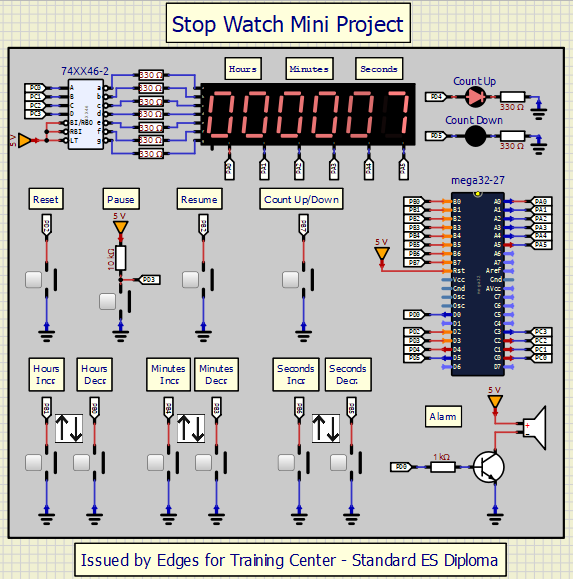

# AVR-Based Dual-Mode Stopwatch

## Overview

This repository contains an AVR-based dual-mode stopwatch project developed as part of the Standard Embedded Systems Diploma issued by EDGES for Training Center. The project demonstrates key embedded systems concepts, including Timer1 interrupts, external interrupts, seven-segment multiplexing, and push button debouncing. The stopwatch operates in two modes:

- **Increment Mode**: Counting up from zero.
- **Countdown Mode**: Counting down from a user-defined time.

The code was developed using Eclipse and simulated using SimulIDE.

## Features

### Dual Modes:

- **Increment Mode**: Counts up from zero, displaying hours, minutes, and seconds.
- **Countdown Mode**: Counts down from a user-defined time, triggering an alarm when it reaches zero.

### User Interaction:

- **Reset Button**: Resets the stopwatch to zero.
- **Pause Button**: Pauses the stopwatch.
- **Resume Button**: Resumes counting from the paused time.
- **Mode Toggle Button**: Switches between increment and countdown modes.
- **Time Adjustment Buttons**: Adjust hours, minutes, and seconds in countdown mode.

### Seven-Segment Multiplexing:

Efficiently drives six seven-segment displays using multiplexing.

### LED Indicators:

- **Red LED**: Indicates increment mode.
- **Yellow LED**: Indicates countdown mode.

### Buzzer Alarm:

- Activates when the countdown reaches zero.

## Software Requirements

- **Eclipse IDE** with AVR plugin for development.
- **AVR GCC Compiler** for compiling the code.
- **SimulIDE** for simulation and testing.

## Code Overview

The project consists of a single C file (`miniProject.c`) that implements the following functionalities:

### Key Functions:

- **timer1\_CTC\_init()**:
  - Configures Timer1 in CTC mode to generate interrupts at regular intervals (1 second).
  - Used for updating the stopwatch timer and refreshing the display.
- **EX\_Interrupts\_init()**:
  - Configures external interrupts for the reset, pause, and resume buttons.
  - **INT0**: Reset button (falling edge).
  - **INT1**: Pause button (rising edge).
  - **INT2**: Resume button (falling edge).

### Interrupt Service Routines (ISRs):

- **ISR(INT0\_vect)**: Resets the stopwatch to zero.
- **ISR(INT1\_vect)**: Pauses the stopwatch.
- **ISR(INT2\_vect)**: Resumes the stopwatch.
- **ISR(TIMER1\_COMPA\_vect)**: Handles timekeeping and buzzer activation in both increment and countdown modes.

### Main Loop:

- Drives the six seven-segment displays using multiplexing.
- Handles button debouncing and time adjustment in countdown mode.

## Simulation

Below is a screenshot of the simulation in SimulIDE:

## Acknowledgments

- **EDGES for Training Center** for providing the opportunity to work on this project as part of the Standard Embedded Systems Diploma.
- The **AVR community** for valuable resources and support.

Thank you for checking out this project! 🚀

